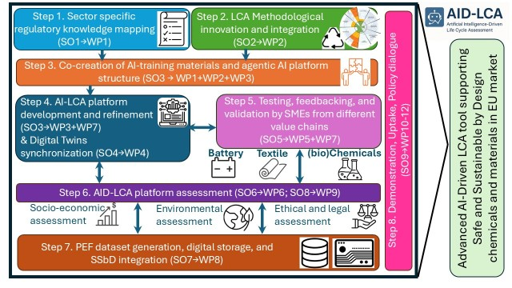
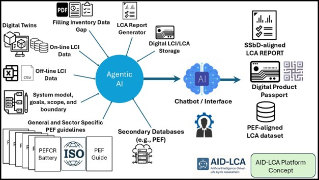

# AID-LCA: Artificial Intelligence-Driven Life Cycle Assessment

## Status

| Item | Value |
|---|---|
| Project state | Ongoing research and development |
| Collaborators | Benyamin Khoshnevisan |
| Contact person | bekh@igt.sdu.dk (If you are willing to use BETA version please contact us.)|
| Open-source plan | This repository will be made open source after the scientific papers are published. |

AID-LCA is a next-generation platform designed to transform Life Cycle Assessment (LCA) into an automated, intelligent, and real-time decision-support system by integrating artificial intelligence, digital twins, and interoperable data infrastructures.

---

## Project Overview

AID-LCA is a collaborative research and innovation initiative aimed at advancing the way Life Cycle Assessment is conducted, applied, and scaled across industries.

The project introduces an AI-powered platform that enables automated LCA workflows, real-time environmental impact assessment, and seamless integration with industrial systems. By combining artificial intelligence with dynamic system modeling and digital infrastructures, AID-LCA moves beyond static LCA practices toward a continuous and adaptive sustainability assessment framework.

The platform is designed to support industrial decision-making, regulatory compliance, and sustainable product development in a consistent and scalable manner.

<p align="center">
  
</p>
---

## Motivation

Life Cycle Assessment is widely recognized as a key methodology for evaluating environmental impacts. However, its adoption and effectiveness are limited by several structural and practical challenges.

Current limitations include:

- High complexity and requirement for specialized expertise  
- Limited accessibility for small and medium-sized enterprises (SMEs)  
- Static and non-dynamic assessment workflows  
- Weak integration with real-world industrial data and systems  
- Insufficient alignment with evolving regulatory frameworks in the European Union  

AID-LCA addresses these challenges by introducing an intelligent, modular, and automated ecosystem that reduces manual effort, improves accessibility, and enables real-time sustainability insights.

---

## Objectives

The main objective of AID-LCA is to develop a modular and intelligent LCA platform that supports automated, real-time, and policy-aligned sustainability assessment.

The platform is designed to:

- Automate LCA modeling and workflow execution using artificial intelligence  
- Enable real-time environmental footprint calculation  
- Support Safe and Sustainable by Design (SSbD) principles  
- Align with EU regulatory frameworks such as Product Environmental Footprint (PEF) and Digital Product Passports (DPPs)  
- Integrate environmental, economic, and social dimensions of sustainability  
- Incorporate circularity and planetary boundary considerations into assessment frameworks  

---

## System Overview

AID-LCA combines data integration, artificial intelligence, and simulation capabilities into a unified architecture that supports continuous sustainability assessment.

The system connects external data sources with internal analytical modules and provides results through a decision-support interface.

```
                  +------------------------------+
                  |     External Data Sources     |
                  |  (IoT, Databases, Sensors)   |
                  +--------------+---------------+
                                 |
                                 v
                    +---------------------------+
                    |   Data Integration Layer  |
                    |   & Interoperability API  |
                    +-------------+-------------+
                                  |
        +-------------------------+--------------------------+
        |                         |                          |
        v                         v                          v
+---------------+      +--------------------+     +--------------------+
|  Agentic AI   |      |   Digital Twins    |     |     LCA Engine     |
| (Decision     |      |   (Simulation)     |     | (Impact Analysis)  |
|  Support)     |      +--------------------+     +--------------------+
+---------------+                |                         |
        |                         +-----------+-------------+
        |                                     |
        v                                     v
            +------------------------------------------+
            |     Sustainability Dashboard & UI        |
            |   (Visualization and Recommendations)    |
            +------------------------------------------+
```

---

## Core Components

### Agentic AI Module
This component enables intelligent automation of LCA workflows. It supports data preprocessing, model generation, interpretation of results, and generation of recommendations. The AI system is designed to provide explainable outputs tailored to different user groups.

### Digital Twin Module
The digital twin component enables dynamic simulation of products and processes. It allows continuous monitoring and updating of environmental impacts based on real-time or streaming data, supporting adaptive and predictive sustainability assessment.

### LCA Engine
The LCA engine performs environmental impact calculations using standardized methodologies such as Product Environmental Footprint (PEF). It integrates foreground and background data and produces structured outputs for analysis and reporting.

### Data Integration Layer
This layer ensures interoperability between different data sources, including industrial systems, IoT devices, and external databases. It standardizes data formats and enables seamless data exchange across components.

### User Interface and Dashboard
The platform includes a visualization and decision-support interface that presents results in a structured and interpretable format. It supports scenario analysis, comparison, and recommendation delivery.



---

## Application Domains

The AID-LCA platform is validated across multiple industrial sectors to ensure robustness and scalability:

- Bio-based chemicals and materials  
- Textile production systems  
- Battery technologies  
- Advanced manufacturing systems  

---

## Platform Capabilities

The platform supports a range of analytical and decision-support functionalities:

- Automated generation of LCA models  
- AI-driven eco-design recommendations  
- Scenario analysis and trade-off evaluation  
- Real-time integration with industrial and IoT data streams  
- Multi-criteria sustainability assessment  
- Visualization and reporting of results  

---

## Expected Impact

AID-LCA aims to deliver significant impact across industry, policy, and research domains:

- Improved accessibility and usability of Life Cycle Assessment  
- Increased adoption of Safe and Sustainable by Design methodologies  
- Support for SMEs in achieving sustainability compliance  
- Enhanced data-driven decision-making capabilities  
- Contribution to climate neutrality and circular economy goals  

---

## Outputs

The project will deliver:

- An AI-powered LCA platform  
- Open-access methodologies and interoperable datasets  
- Industrial case studies and validation results  
- Training materials and capacity-building activities  
- Scientific publications and technical reports  

---

## Vision

AID-LCA envisions a future where sustainability assessment is:

- Real-time  
- Automated  
- Transparent  
- Accessible to all stakeholders  

By integrating artificial intelligence with sustainability science and industrial systems, the project enables a new generation of intelligent environmental decision-support tools.

---
